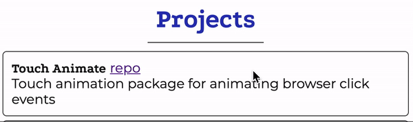

# touch-animate
A small library for creating animated touch events



## Installing
In order to install from [Github Packages](https://github.com/features/packages) you might need to create a personal access token first, check the instructions [here](https://help.github.com/en/github/authenticating-to-github/creating-a-personal-access-token-for-the-command-line).
```
npm install @faelks/touch-animate
```

## Usage
To use the library, you first need to figure out where you want to apply the touch effect. Should it apply everywhere or just on a single element?

```javascript
import { addTouchAnimation } from "@faelks/touch-animate";

...
// To recreate the effect in the gif at the top of this readme.
addTouchAnimation({
  element: document.getElementById("particle"),
  duration: 500,
  radius: 30,
  color: "black",
  type: "particle"
});
```

## Options
| Name | Description | Default | Accepted Values | 
|---|---|---|---|
| element | The html element you want to apply the touch animation to. For example `document.querySelector('#myDiv')` | `document.body` | Any valid html element |
| type | Identifier of the type of effect you want to display. | `'swell'` | `swell`, `particle`, `spiral` |
| duration | The duration of the animation in ms | `600` | Any integer greater than 0 |
| steps | The number of animation steps, a higher value means that the animation will have a higher refresh rate | `200` | Any integer greater than 0 |
| radius | The touch animations are displayed using the `<canvas>` tag, this option determines the radius of this element in the DOM | `30` | Any integer greater than 0 |
| color | The CSS color that you want to apply to your effect, accepts any css property so gradients work | `'black'` | Any valid CSS `color` value |
| particleCount | Only applicable for the `particle` animation, determines how many particles to animate | `50` | Any integer greater than 0 |
| debug | Used for visual debugging, outlines the canvas and x/y coordinates of click event | `false` | `true` / `false` |